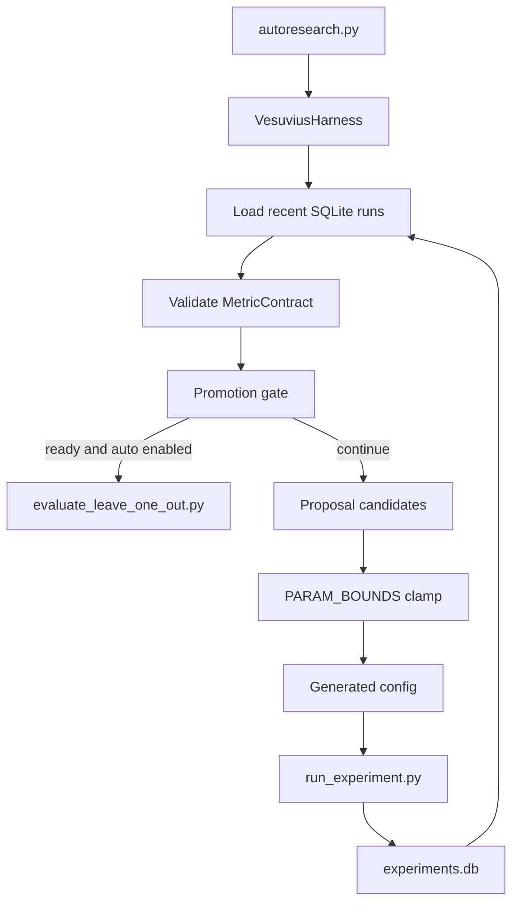

# Vesuvius AutoResearch

Minimal continuous experiment pipeline for Vesuvius ScrollPrize ink-detection research.

The active workflow uses real Vesuvius data only. If real prepared NPZs or official data access are unavailable, runs fail loudly instead of falling back to fake data.

## Open-Source Prize Readiness

This repository is packaged for Scroll Prize open-source review: code is MIT licensed, raw data and generated artifacts are excluded from git, and reproducibility metadata is documented separately from local experiment outputs.

Reviewer-facing docs:

- `DATA.md`: data sources, licensing, local paths, and no-overlap safety rules.
- `METHOD.md`: model pipeline, validation gates, hard-negative mining, and hallucination controls.
- `REPRODUCE.md`: clean install, tests, data preparation, run, LOO, full-tile, and dashboard commands.
- `CITATION.cff`: citation metadata for this repo and required dataset attribution.
- `artifacts/README.md`, `weights/README.md`, and `submission/`: templates for external artifacts and prize package metadata.

Quick setup from a clean clone:

```bash
python3 -m venv .venv
.venv/bin/python -m pip install --upgrade pip
.venv/bin/python -m pip install -e .
.venv/bin/python scripts/setup_data.py --data-dir ./data
.venv/bin/python -m pytest tests/
```

## Setup

Generate baseline and robust pivot configs for your prepared Vesuvius NPZ directory with:

```bash
python3 scripts/setup_data.py --data-dir ./data
```

The script writes `configs/baseline.yaml` plus the four robust pivot configs used by AutoResearch. It currently leaves authenticated ScrollPrize/public-mirror downloads as explicit TODO stubs and records the expected prepared NPZ paths in generated YAML.

## Health Check

Verify the installation with `python -m pytest tests/ && python autoresearch.py --plan --json && python -c "from harness.vesuvius_harness import VesuviusHarness; print('ok')" && python -c "from autoresearch import METRIC_CONTRACT, PARAM_BOUNDS; print(len(PARAM_BOUNDS), 'bounds')"`.

Current `python3 autoresearch.py --plan --json` state, redacted to omit local absolute paths, remains promotion review oriented after the full-tile evidence package:

```json
{
  "status": "promotion_ready",
  "candidate_run_id": "20260528T163849Z_17863aaa",
  "next_action": "Review full-tile quality evidence before promotion for segment 20230522181603",
  "proposals": [],
  "reasoning": [
    "promotion_gate_ready",
    "pause_exploration_before_more_local_sweeps",
    "candidate_linked_evidence_available"
  ],
  "promotion_actions": [
    {
      "id": "quality_review",
      "kind": "quality",
      "quality_verdict": "review",
      "segment_id": "20230522181603",
      "target": "candidate_full_tile"
    },
    {
      "id": "promotion_review",
      "kind": "review",
      "label": "Review promotion candidate 20260528T163849Z_17863aaa"
    }
  ]
}
```

The planner may also print warnings for older pre-contract rows missing `ap_prevalence_lift`; current post-fix rows include that MetricContract key. Clean-provenance retrain `20260529T014355Z_5fc7c1ca` fixed full-tile provenance eligibility but exposed empty-positive validation strips. Strip-fix candidate `20260529T021416Z_570f6775` removed zero precision/recall LOO folds and reached three-seed median-over-seeds median `val_f1=0.1109`, but promotion is still blocked by positive-rate alarms.

For continued diagnostic sweeps after promotion review is blocked, use `AUTORESEARCH_CONTINUE_AFTER_PROMOTION_ACTION=1 AUTORESEARCH_PAUSE_WHEN_PROMOTION_READY=0` with `.venv/bin/python autoresearch.py`; promote-phase planning now includes loss-calibration proposals such as `training.positive_rate_loss_tolerance: 0.01` as well as the `2.5-3.0` positive-rate cap band.

## Architecture



The core loop is intentionally local and inspectable: it initializes the active harness before pruning generated configs, reads experiment rows from SQLite, validates metric keys, checks promotion evidence, proposes one-change configs through bounded mutation logic, and executes the standard experiment runner. Harness import errors fail closed before pruning so a broken adapter cannot partially run AutoResearch.

SQLite state is initialized by `experiments.runner.init_db`: `experiments` stores run configs, metrics, artifact paths, and config signatures; `promotion_results` stores automated promotion command statuses and payload JSON for review.

## Configuration Reference

| Section | Key | Purpose |
| --- | --- | --- |
| `dataset` | `train_npz`, `val_npz` | Prepared NPZ inputs; both are required together. |
| `dataset` | `research_scope`, `validation_mode` | Search and promotion scope labels. |
| `model` | `name`, `base_channels`, `depth` | Model family and capacity controls. |
| `training` | `learning_rate`, `weight_decay`, `pos_weight`, `epochs` | Mutable optimizer/loss parameters clamped by `PARAM_BOUNDS`. |
| `training` | `positive_rate_loss_weight`, `positive_rate_loss_tolerance`, `max_train_samples` | Positive-rate calibration and sample-budget controls; AutoResearch can propose the recent 4096-sample residual setting when the configured sample cap permits it. |
| `evaluation` | `main_metric`, `threshold`, `max_pred_positive_rate_ratio` | Main scoring metric, fixed-threshold diagnostic, and positive-rate cap; proposal search includes the evidence-backed `2.5-3.0` cap band. |
| `autoresearch` | `scope_policy`, `promotable`, `promotion_required` | Search metadata and promotion gating intent. |
| `outputs` | `runs_dir` | Experiment artifact root. |

## Harness Extension

The harness layer lives in `harness/`. Implement `ResearchHarness` from `harness/base.py` to pivot this project toward another ScrollPrize research loop while keeping the same propose/evaluate/promote lifecycle. See [`harness/README.md`](harness/README.md) for the minimal interface and `harness/vesuvius_harness.py` for the adapter over current Vesuvius logic.

## Cron And CI

`.github/workflows/autoresearch_test.yml` runs the full unit suite on push and pull request. `.github/workflows/autoresearch_cron.yml` runs every 30 minutes, supports manual `workflow_dispatch`, and uploads `logs/` plus generated configs as artifacts. The cron workflow skips execution and uploads a warning artifact if `configs/baseline.yaml` is absent; run `scripts/setup_data.py` locally and commit `configs/baseline.yaml` to enable live cron runs.

Install optional public-data ingestion support with:

```bash
.venv/bin/python -m pip install -e '.[ingestion]'
```

Do not commit generated data, model weights, experiment databases, logs, full-tile outputs, mined hard negatives, or decoded text/image outputs. Large reproducibility artifacts should be published externally with checksums and described in `artifacts/README.md` or `weights/README.md`.

## Research Workflow Principles

- Optimize for rare-positive ink detection, not generic accuracy or loss alone.
- Use cross-segment/cross-scroll validation when labeled real data exists. The installed `vesuvius` package catalog is stale, but the public Scroll 1 segment directory exposes 33 exact Zarr-plus-inklabel pairs, so `configs/baseline.yaml` now uses cross-segment validation.
- Ensure validation strips contain positives when the source held-out segment contains ink; empty-positive held-out strips are a data-preparation artifact and must not be interpreted as model collapse.
- Promote runs by threshold-swept `val_f1`; a lower loss that predicts no positive ink is not useful.
- Log threshold diagnostics for every run in `metrics_by_threshold.csv` and inspect `best_threshold`, `average_precision`, `pred_positive_rate`, and probability quantiles before trusting a result.
- Treat `evaluation.threshold: 0.50` as a diagnostic baseline, not a deployable operating point, until calibration evidence says otherwise. Recent full-tile runs have `fixed_threshold_f1=0.0` and selected thresholds around `0.28-0.34`.
- Compare `average_precision` against positive-label prevalence: a random ranker has expected AP near `val_positive_rate`. AP above prevalence shows ranking signal, but deployment still needs threshold calibration and full-tile checks.
- Keep AutoResearch proposals interpretable: one change per generated config.
- Keep each research cycle focused on one data scope. The active baseline uses one train segment and one held-out validation segment; AutoResearch preserves those exact NPZ paths and only changes model/training/evaluation knobs. Add additional segments only by creating an explicit fold config, then compare folds separately.
- AutoResearch follows the robust/torch best path first: it starts from `robust_multisegment_dice035_expanded.yaml`, then the TTA/seed-ensemble and residual 2.5D configs, with CPU-safe sample bounds for unattended cron. It reserves generated configs to avoid pending reruns, labels cron output as non-promotable exploration, gates recent bases with AP/precision/recall/positive-rate checks, and tries strategic Tversky, hard-mining, and threshold-calibration moves before using the old focused NumPy fallback.
- Treat `source: vesuvius_segment_zarr`, `vesuvius_public_segment_zarr`, and validated `prepared_npz` as valid active research sources.

## Run Artifacts

Each experiment writes:

- `config.json`: resolved config and data metadata.
- `metrics.json`: headline metrics, threshold-swept best F1/F0.5, positive rates, and probability diagnostics.
- `metrics_by_threshold.csv`: precision/recall/F0.5/F1 over candidate thresholds.
- `weights.npy`: tiny NumPy logistic-regression weights.
- `run_summary.md`: human-readable steering summary.

Resolved experiment configs are deduped by canonical `config_signature` before artifact creation. Re-running an identical config may return the prior run with `deduped: true` instead of writing another `experiments/runs/<run_id>/` directory.

## Next-Best Move Protocols

The current next moves are documented in `docs/next_best_moves_may2026.md` and sketched in `configs/next_best_moves_robust_template.yaml`. Treat them as promotion protocols, not one-off sweep ideas:

- Seed-repeat leave-one-out: run each LOO fold across at least three seeds and promote by median-over-seeds, then median-over-folds.
- Safe data expansion: add labeled public segments only through explicit fold maps; never mix a held-out segment into its training NPZ.
- Full-tile inference: validate thresholded predictions on uniformly tiled validation regions, not only positive-biased sampled patches.
- Calibration review: report Brier score, expected calibration error, AP/prevalence lift, fixed-threshold status, and whether threshold selection was positive-rate-constrained.
- Promotion evidence linkage: LOO summaries and full-tile metrics must match the same robust candidate/config lineage; unrelated global evidence is diagnostic only.
- TTA/seed ensembling: average flip TTA and independent seed probabilities only after single-seed LOO behavior is understood.
- 2.5D residual U-Net: prepare multi-z-channel NPZs first, then test a residual U-Net family behind the same LOO gate.

Before launching unattended exploration, inspect the next AutoResearch cycle without writing generated configs or run artifacts:

```bash
python3 autoresearch.py --plan
python3 autoresearch.py --plan --json
```

If the dashboard promotion gate is ready, AutoResearch pauses exploration by default and prints the candidate-linked promotion/verification action instead of generating more local F1 micro-sweeps. Planning JSON includes the selected action, candidate run, reasoning trace, and copyable command; weak-fold public full-tile commands include whole-fetch retry and chunk-level pacing flags. Override direct `autoresearch.py` runs only for deliberate diagnostics with `AUTORESEARCH_PAUSE_WHEN_PROMOTION_READY=0` or `AUTORESEARCH_CONTINUE_AFTER_PROMOTION_ACTION=1`. The guarded cron launcher forces promotion-safe defaults unless `SCROLL_RESEARCH_ALLOW_PROMOTION_OVERRIDE=1` is also set.

Set `AUTORESEARCH_AUTO_PROMOTE=1` to let AutoResearch run the printed seed-repeat leave-one-out command automatically. Automation is disabled by default, writes `logs/promotion_<timestamp>.log`, records `promotion_results` rows in SQLite, and uses `AUTORESEARCH_PROMOTION_TIMEOUT_SECONDS=3600` unless overridden. Promotion rows use `SUCCEEDED` when the subprocess exits 0 and writes the expected summary, `SUCCEEDED_NO_SUMMARY` when it exits 0 but the summary JSON is missing, and `FAILED` when the command errors or times out. Treat `SUCCEEDED_NO_SUMMARY` as operationally incomplete evidence: inspect the log and rerun with a valid `--summary-json` path before promoting.

Seed-repeat LOO can be accelerated with independent process workers while preserving deterministic JSONL order:

```bash
python3 scripts/evaluate_leave_one_out.py \
  --base-config configs/robust_calibrated_prloss_w0p03_lr0012.yaml \
  --fold-map data/real_cross_folds_expanded_combined/fold_map.json \
  --output-jsonl logs/robust_candidate_seedrepeat.jsonl \
  --summary-json logs/robust_candidate_seedrepeat.summary.json \
  --seeds 11001,11018,15050 \
  --jobs 6 \
  --execution-mode fold-major \
  --limit-worker-threads
```

`fold-major` schedules all seed repeats for a held-out fold together, reducing repeated setup while preserving the row schema and summary behavior. Keep `--jobs` matched to `training.num_threads` on CPU hosts because each worker writes independent run artifacts and shares the experiment DB. Pending generated `configs/auto_*` signatures expire after `AUTORESEARCH_PENDING_CONFIG_TTL_HOURS=24` by default so crashed proposal files do not block future search forever; set it to `0` to reserve all generated configs indefinitely.

AutoResearch prunes stale generated `configs/auto_*.yaml` files older than 48 hours at process startup. This keeps cron proposal accumulation bounded while preserving manual configs, baseline configs, and curated robust pivot configs.

GitHub Actions workflows are available in `.github/workflows/`: `autoresearch_test.yml` runs `python -m pytest tests/` on push and pull request, while `autoresearch_cron.yml` runs AutoResearch every 30 minutes and uploads `logs/` plus generated configs as artifacts.

The autoresearch loop now runs through `harness.VesuviusHarness`, a thin adapter over the existing Vesuvius-specific logic. See `harness/README.md` for the base `ResearchHarness` interface and extension pattern for future ScrollPrize research harnesses.

For distributed-lite execution, enqueue existing config paths through `experiments.jobs.enqueue_experiment_config(...)` and run workers with the same core experiment runner:

```bash
python3 scripts/run_job_worker.py --once
python3 scripts/run_job_worker.py --max-jobs 4 --worker-id cpu-worker-1
```

Workers only dispatch queued config paths to `experiments.runner.run_experiment`; they do not compute alternate metrics or bypass validation/promotion gates.

## Standalone Dashboard

Launch the read-only Vesuvius dashboard without Hermes:

```bash
python3 run_dashboard.py --host 127.0.0.1 --port 8765
```

The shared snapshot contract can also be exported with:

```bash
python3 scripts/export_dashboard_snapshot.py --pretty
```

For a read-only project state audit in JSON or Markdown:

```bash
python3 scripts/audit_research_state.py
python3 scripts/audit_research_state.py --markdown
```

Package the current read-only next-move evidence in one artifact-reuse report:

```bash
python3 scripts/package_next_move_evidence.py \
  --caps 1.75,2.0,2.5,3.0,3.5 \
  --markdown
```

This composes the dashboard snapshot, hard-negative/cap planner, planner-suggested cap comparisons, and optional full-tile pairs without writing run, mined-data, or log artifacts.
The report includes a synthesized `Recommended Next Move` so reviewers can distinguish promotion review, cap tightening, full-tile regression review, and fold-safe mining review without rerunning training.
Cap tightening is all-artifact gated: every planner-suggested cap comparison must produce a retained-cap recommendation, and any mining command is marked with command-level artifact-writing and dashboard-safety fields.

Compare seed-repeat LOO summaries with explicit gates before spending full-tile budget:

```bash
python3 scripts/compare_loo_summaries.py \
  --candidate logs/new_candidate.summary.json \
  --baseline current_best=logs/current_best.summary.json \
  --min-median-over-seeds-f1 0.1788 \
  --min-mean-ap 0.1374 \
  --min-worst-fold-f1 0.0594 \
  --markdown
```

Package single-seed versus ensemble full-tile evidence from existing artifacts before claiming ensemble lift:

```bash
python3 scripts/compare_full_tile_metrics.py \
  --pair 20230522181603=experiments/runs/<single_seed_run>/full_tile_20230522181603/metrics.json,experiments/runs/<ensemble_run>/full_tile_20230522181603/metrics.json \
  --pair 20230530212931=experiments/runs/<single_seed_run>/full_tile_20230530212931/metrics.json,experiments/runs/<ensemble_run>/full_tile_20230530212931/metrics.json \
  --fail-on-core-regression \
  --markdown
```

This command is read-only. It reports per-segment and aggregate deltas for F1, F0.5, AP, AP/prevalence lift, pred/val ratio, and calibration so ensemble evidence stays tied to whole-segment artifacts instead of generated claims.

Compare positive-rate caps from an existing full-tile `metrics_by_threshold.csv` without retraining:

```bash
python3 scripts/compare_threshold_caps.py \
  --metrics experiments/runs/<run>/full_tile_<segment>/metrics.json \
  --caps 2.0,2.5,3.0,3.5 \
  --min-retained-f1 0.95 \
  --min-retained-f05 0.95 \
  --markdown
```

Recompute an existing LOO JSONL under a new cap using saved per-run threshold CSVs:

```bash
python3 scripts/recompute_loo_threshold_cap.py \
  --input-jsonl logs/current_candidate_loo.jsonl \
  --output-jsonl logs/current_candidate_prratio2p5_recomputed_loo.jsonl \
  --summary-json logs/current_candidate_prratio2p5_recomputed_loo.summary.json \
  --cap 2.5
```

For faster cap selection, sweep multiple caps in one artifact-reuse pass:

```bash
python3 scripts/recompute_loo_threshold_cap.py \
  --input-jsonl logs/current_candidate_loo.jsonl \
  --caps 2.0,2.25,2.5,2.75,3.0 \
  --output-dir logs/cap_sweeps \
  --output-prefix current_candidate \
  --aggregate-json logs/cap_sweeps/current_candidate.aggregate.json \
  --aggregate-markdown logs/cap_sweeps/current_candidate.aggregate.md
```

See `docs/dashboard.md` for data sources, safety rules, and the parallel-development workflow for keeping standalone and host dashboards aligned.

Useful local sanity commands:

```bash
python scripts/evaluate_leave_one_out.py \
  --base-config configs/robust_multisegment_dice035_expanded.yaml \
  --fold-map data/real_cross_folds_expanded_combined/fold_map.json \
  --output-jsonl logs/robust_multisegment_dice035_expanded_seed11001_loo.jsonl \
  --summary-json logs/robust_multisegment_dice035_expanded_seed11001_loo.summary.json \
  --dry-run

python scripts/prepare_vesuvius_segment_npz.py \
  --segment-id 20230827161847 \
  --catalog-source public-directory \
  --output-dir data/real_25d/segment_20230827161847 \
  --patch-size 64 \
  --z-offsets=-8,-4,0,4,8 \
  --val-tiled \
  --val-stride 64
```

## Real Vesuvius Data Ingestion

The runner consumes prepared NPZ files with this schema:

```text
images: float32-like [N, C, H, W], normalized image patches; C>=1 allows multi-slice Zarr context
labels: float32-like [N, 1, H, W], binary ink labels
```

Use explicit NPZ paths to train on real prepared data without synthetic fallback:

```yaml
dataset:
  research_scope: focused_pair
  train_npz: /path/to/real_train_patches.npz
  val_npz: /path/to/real_val_patches.npz
  patch_size: 64
```

If either `train_npz` or `val_npz` is provided, both are required and are validated before training. Invalid real-data paths fail loudly instead of falling back to synthetic data.

Optional official tooling for preparing those NPZ files:

```bash
python3 -m venv .venv
.venv/bin/python -m pip install vesuvius tifffile pillow zarr s3fs
.venv/bin/vesuvius.accept_terms --yes
```

Practical ingestion targets:

- Official `vesuvius.Volume("<segment_id>")` segment surface volumes with `segment.inklabel` when labels are available.
- Local Kaggle-style fragment folders containing `surface_volume/*.tif`, `inklabels.png`, and optionally `mask.png`.
- OME-Zarr CT volumes from public open-data mirrors for unlabeled inference/evaluation, paired with labels only where available.

For local TIFF/PNG fragment or segment folders, prepare NPZs with:

```bash
python scripts/prepare_local_vesuvius_npz.py \
  --root /path/to/fragment_or_segment \
  --output data/real/train_frag.npz \
  --split train \
  --patch-size 64 \
  --samples 512 \
  --positive-fraction 0.5
```

Then point a config at the generated train/validation NPZ files.

For a same-segment comparison dataset:

```bash
.venv/bin/python scripts/prepare_vesuvius_segment_npz.py \
  --segment-id 20230827161847 \
  --output-dir data/real/segment_20230827161847 \
  --level 1 \
  --patch-size 64
```

To inspect all official catalog candidates before preparing data:

```bash
.venv/bin/python scripts/prepare_vesuvius_segment_npz.py --list-labeled --catalog-source public-directory
```

To prepare every labeled segment exposed by the public Scroll 1 segment directory, without synthetic fallback:

```bash
.venv/bin/python scripts/prepare_vesuvius_segment_npz.py --all-labeled --catalog-source public-directory --output-root data/real
```

Public Zarr reads use the fast direct layer path by default. If the public mirror returns `429 Too Many Requests`, opt into chunk-aligned pacing and retries with `--public-chunk-delay-sec`, `--public-chunk-retry-count`, and `--public-chunk-retry-delay-sec`; full-tile inference exposes the same flags alongside `--public-retry-count` and `--public-retry-delay-sec`.

The installed `vesuvius==0.2.4` catalog exposes only one segment, but the public directory lists 33 exact labeled segment pairs. The active cross-segment baseline uses:

- Train segment: `20230827161847`
- Validation segment: `20230520175435`
- Zarr/label base: `https://dl.ash2txt.org/other/dev/scrolls/1/segments/54keV_7.91um/`
- Current prepared cross-segment paths: `data/real_cross/segment_20230827161847/train.npz` and `data/real_cross/segment_20230520175435/val.npz`

Do not load all 33 labeled segments into one headline experiment by default. Use them to create focused fold configs, for example train on one segment and validate on one held-out segment, then rotate the held-out segment when the current fold has been understood.

The stale installed-catalog blocker can also be partly resolved by installing optional package dependencies (`lxml`, `nest_asyncio`) and refreshing the package catalog, but public-directory label filtering is still required because many public Zarrs do not have labels.
